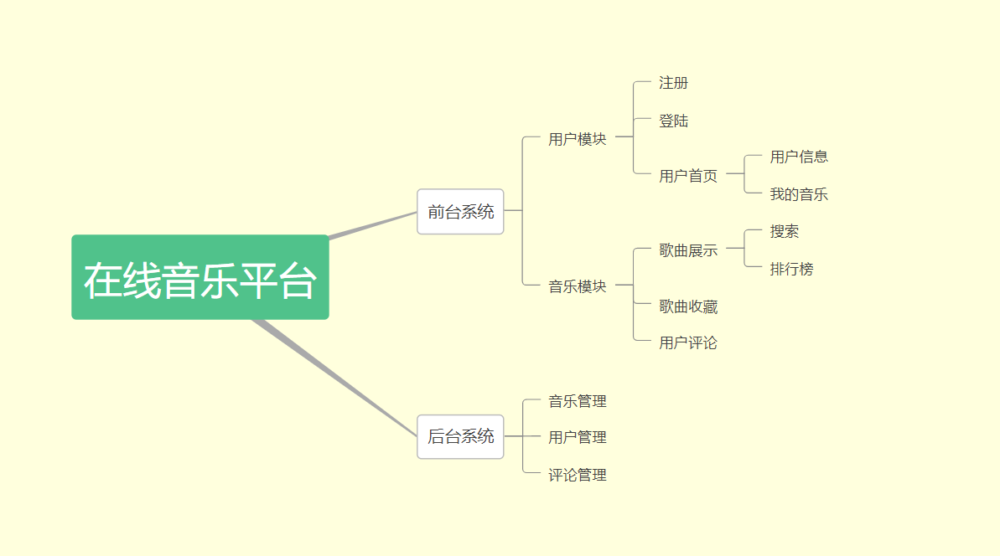

# music_online 在线音乐平台
                       _oo0oo_
                      o8888888o
                      88" . "88
                      (| -_- |)
                      0\  =  /0
                    ___/`---'\___
                  .' \\|     |// '.
                 / \\|||  :  |||// \
                / _||||| -:- |||||- \
               |   | \\\  -  /// |   |
               | \_|  ''\---/''  |_/ |
               \  .-\__  '-'  ___/-. /
             ___'. .'  /--.--\  `. .'___
          ."" '<  `.___\_<|>_/___.' >' "".
         | | :  `- \`.;`\ _ /`;.`/ - ` : | |
         \  \ `_.   \_ __\ /__ _/   .-` /  /
     =====`-.____`.___ \_____/___.-`___.-'=====
                       `=---='


     ~~~~~~~~~~~~~~~~~~~~~~~~~~~~~~~~~~~~~~~~~~~

               佛祖保佑         永无BUG

#### 功能模块图


#### 技术栈
- 前端
> - Vue.js
- 后端
> - Spring Boot
> - MyBatis

#### 后台界面
[https://github.com/liukc/music_web](https://github.com/liukc/music_web)

#### API设计规范
> - [RESTful API 设计指南](http://www.ruanyifeng.com/blog/2014/05/restful_api.html)

#### API文档(http://localhost:8080/swagger-ui.html )
> - [在 Spring Boot 项目中使用 Swagger 文档](https://www.ibm.com/developerworks/cn/java/j-using-swagger-in-a-spring-boot-project/index.html)

#### 相关文档
- [系统设计说明书](https://shimo.im/docs/XHUBDhY5mvU0ud3x/)
- [需求规格说明书](https://shimo.im/docs/prs9JQQDFe48Ltl6/)
- [项目启动会议](https://shimo.im/docs/ePgaOny3JtEzavMb/)
- [项目立项报告](https://shimo.im/docs/VWce1eVmI9QS2y2S/)

#### 数据源
- [网易云API](https://zhuanlan.zhihu.com/p/30246788)

#### 技术参考
- [MyBatis 官方中文文档](http://www.mybatis.org/mybatis-3/zh/index.html)

#### 协作需要使用到的git命令 ([附上IDEA可视化操作](https://blog.csdn.net/autfish/article/details/52513465))

-  添加远程仓库地址 (此步只需要操作一次)
```text
git remote add upstream https://github.com/wt-git-repository/music_online.git
```

-  在每次开发之前，都要运行以下命令， 以保证代码可以与团队保持同步
```text
git fetch upstream  # 拉取远程分支的代码到本地中
git merge upstream/master # 将远程分支的代码合并到本地中
```


-  提交代码到自己存库中
```text
git add .
git commit -m "提交说明（自己编写）"
git push
```

> 注意：提交代码到自己存库之后，还需要到github上面进行pull request操作  
pull request 是为了把自己仓库的代码推送到远程分支中

#### 